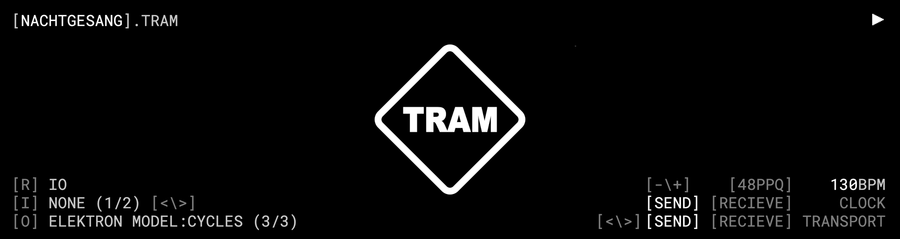
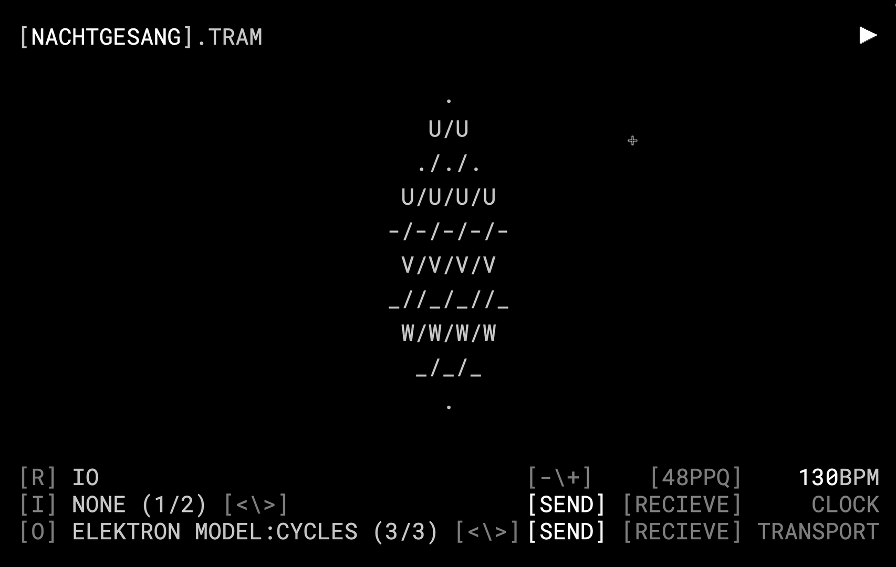
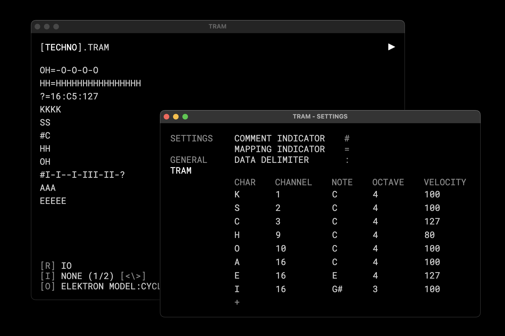

# TRAM

TRAM is short for **T**ypographic **R**ythm **A**utomation **M**achine and is a live coding enviroment for MIDI.

Please refer to [this](https://github.com/adult-video/tram) documentation for the programming language TRAM.





## Installation

There are two ways to use TRAM. Either install a build for your platform from itch.io: [acidatm.itch.io/tram](https://acidatm.itch.io/tram)

Or run it within electron.js

```
git clone --recurse-submodules https://github.com/adult-video/tram-app.git
cd tram-app/app
npm install
npm start
```

## Usage

Please refer to the documentations for TRAM on how to use the specific language.

### UI

From the UI you can access many functions that are also accessible from the main menu. They will be explained in their respective menu subsection. The only function exclusively available in the UI is the option to rename the file. Simply click on the filename written in square brackets in the top right corner to edit the filename.

### File

- Save - Will save the current state as a `.tram` file
- Open - Allows you to open a previously state that was saved to file.
- Settings - Will open the Settings window

### View

- Zoom In - Increases the fontsize. Mirrored in `Settings`
- Zoom Out - Decreses the fontsize. Mirrored in `Settings`
- Text Align - Toggles between text alignment on the left and in the center for all main inputs. Mirrored in `Settings`
- Toggle UI - Toggles the display of the UI in the main window.

### Transport

- Play Pause - Toggles between play and pause state of the transport. Will only stop the MIDI clock, not send a reset and note off message.
- Stop - Stops playback and resets sequencer to step 1. Will send reset and note off message via MIDI as well as stop sending MIDI clock.
- Tempo Up - Ups the tempo by 1 bpm.
- Tempo Down - Lowers the tempo by 1 bpm.
- Tap Tempo - Will set the tempo based on the interval that the shortcut is being used with.
- Forwards - Will add a 50ms delay to the sent MIDI message and advance the time uniform for the shader. Can be used to fix MIDI lag and to step through the visual when playback is stopped.
- Backwards - Will remove 50ms delay. The delay is reset when the application is restarted. Current delay is not visible anywhere.

### IO

- Refresh IO - Will check for new MIDI devices
- Next Input - Steps through all available inputs
- Previous Input - Steps through all available inputs
- Next Output - Steps through all available outputs
- Previous Output - Steps through all available inputs
- Toggle Clock Send - Toggles the MIDI clock send
- Toggle Clock Recieve - Toggles the MIDI clock recieve
- Clock Type - Changes the clock type between 24ppq and 48ppq for send **and** recieve. The application runs on a 48ppq clock.
- Toggle Transport Send - Toggles the MIDI transport send. NOTE: some devices will only accept transport messages when a clock signal is sent as well
- Toggle Transport Recieve - Toggles the MIDI transport recieve

## Some notes on the MIDI implementation

MIDI is a tricky thing. The MIDI implementation in this application is as good as it needed to be so far. But there are a couple of known pitfalls and shortcomings.

The sequencer is written to look ahead by 1 step. This results in MIDI messages not being laggy when the application becomes laggy. But this also results in the first step not being sent when the sequencer is reset.

The transport recieve only supports the playing and stopped state. There is no way to recieve a paused state.

The transport send will send the reset message when the sequencer is stopped. Not when the playback is resumed after a stop. This is different from the MIDI implementation on some devices (Elektron devices for instance).

When the same device is selected as an input and output some clock and transport send and recieve settings can result in weird behavior or not work as expected. In general its advisable to either use the application as a MIDI Thru device or as the Master device in the chain.

While clock recieve works, the syncing is not always perfect and the tempo display may take a second to update. In general its advisable to either sent all note data from the application or to only use the application for visuals. Mixing note data on the device sequencer with note data from the application can result in audible lags. You can use the `Transport>Forward` and `Transport>Backward` function to prevent this but its only a momentary fix.

Making a lot of inputs in a short time can result in audible lag.

Changing tempo will result in a pause of playback.

When clock recieve is turned on the internal clock will be disabled, regardless if the selected input is sending a clock signal or not.

## Version History

- **0.1.0** - Initial release
- **0.2.0** - Switched from sample based engine to MIDI
  - **0.2.1** - Fixed wrong shortcuts

- **0.3.0** - Added editor and mapping window, added support for mapping words
- **0.4.0** - Refactoring, switch to shared codebase for all adult-video projects, replaced editor and mapping with settings, added default sampler, improved MIDI implementation

## Known Issues

- Currently there are no build for Windows and Linux platforms available
- Many keyboard shortcuts do not work on Windows
- MIDI (see note above)

## Future Plans

- Builds for all platforms
- Add export for MIDI clips
- Add support for premapped messages that are not note-on commands
- Add support for OSC
- Improve MIDI clock and transport implementation
- Improve MIDI implementation

## Acknowledgement

Please refer to the respective repository for TRAM